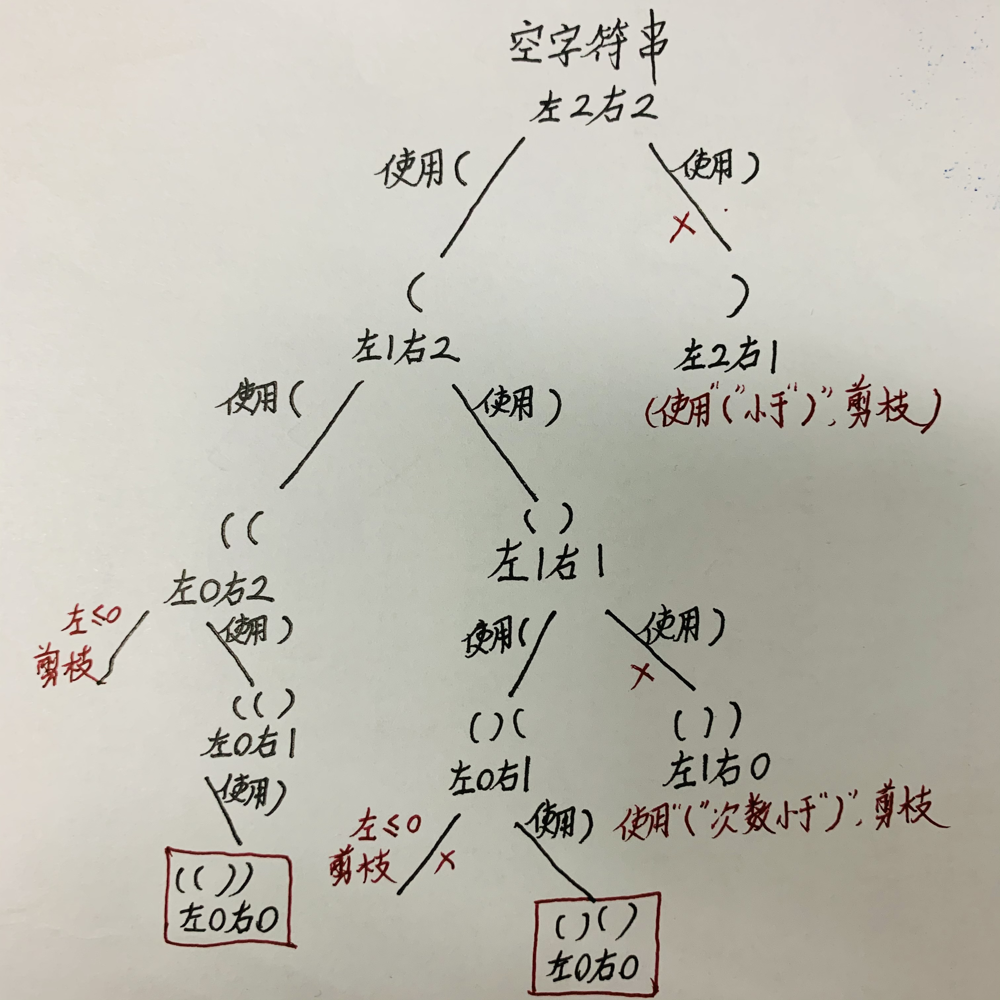

# 22.括号生成

## 题目
数字 n 代表生成括号的对数，请你设计一个函数，用于能够生成所有可能的并且 有效的 括号组合。


    示例：

    输入：n = 3
    输出：[
        "((()))",
        "(()())",
        "(())()",
        "()(())",
        "()()()"
        ]

## 方法（回溯法）
对于回溯法，需要重点关注三点：
* 结束条件：起初我们手中有n个左括号和n个右括号，当左括号和右括号都用完时，递归结束。将路径字符串加入res
* 选择：在每一步中我们都有两个选择：选一个左括号或选一个右括号。但是也有以下前提条件：
   * 能够选左括号的前提：左括号数量大于0
   * 能够选右括号的前提：已使用的左括号数量大于已使用的右括号数量。（产生右括号时，前面如果没有足够的左括号与之匹配，则会产生不合理的字符串结果），即左括号剩余数量left要大于右括号剩余数量right。
  
  在做选择时，考虑以上两个条件，即可实现剪枝操作。
* 路径：路径内容应该包括：已产生的字符串path，剩余的左括号left以及剩余的右括号right。

例如，n=2时，可以画出决策树如下：


## 代码
```java
class Solution {
    List<String> res = new LinkedList<>();
    int n;
    public List<String> generateParenthesis(int n) {
        this.n = n;
        backtrack(new StringBuilder(), n, n);
        return res;
    }

    public void backtrack(StringBuilder path, int left, int right){
        //结束条件
        if(left == 0 && right == 0){
            res.add(new String(path));
            return;
        }
        //选择1：使用左括号
        if(left > 0){
            path.append('(');
            backtrack(path, left - 1, right);
            path.deleteCharAt(path.length() - 1);
        }
        //选择2：使用右括号
        if(left < right && right > 0){
            path.append(')');
            backtrack(path, left, right - 1);
            path.deleteCharAt(path.length() - 1);
        }
    }
}
```
