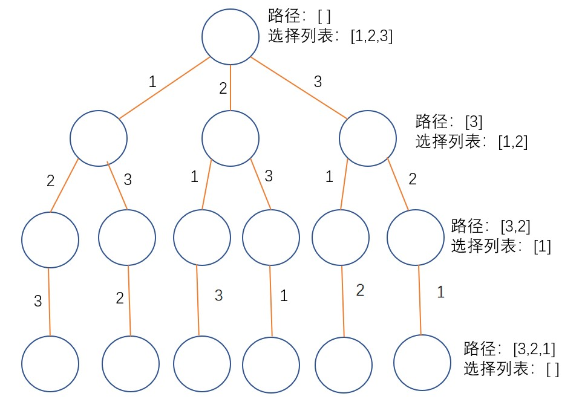

# 46.全排列

## 题目
给定一个 没有重复 数字的序列，返回其所有可能的全排列。

    示例:
    输入: [1,2,3]
    输出:
    [
    [1,2,3],
    [1,3,2],
    [2,1,3],
    [2,3,1],
    [3,1,2],
    [3,2,1]
    ]

## 方法（回溯法）
对于回溯法，需要重点考虑三个问题：
* 路径：目前为止已经做出的选择
* 选择列表：当前可以做的选择
* 结束条件：到达决策树的叶节点时，无法再继续做选择，结束。

通常回溯法适合用递归来实现。当我们到达一个节点时，尝试所有可能的选择。
* 在做出一个选择之后，将该选择从选择列表中移除，并向路径中添加该选择。
* 之后递归进入下一个节点。
* 递归退出后再撤销刚才的选择，向选择列表中再加回此选择，再将选择从路径中移除。

下图表示了本题对应的决策树：



## 代码
```java
List<List<Integer>> res = new LinkedList<>();
boolean[] used = new boolean[nums.length];
public List<List<Integer>> permute(int[] nums) {
    LinkedList<Integer> path = new LinkedList<>();
    backtrack(nums, path);
    return res;
}

public void backtrack(int[] nums, LinkedList<Integer> path){
    //满足结束条件时，向结果数组中添加当前路径。
    if(path.size() == nums.length){
        res.add(new LinkedList(path));
        return;
    }
    for(int i = 0; i < nums.length; i++){
        //如果当前路径中已包含元素nums[i]，则是非法的选择，直接跳过。
        if(used[i])
            continue;
        //做选择
        path.add(nums[i]);
        used[i] = true;
        //进入递归
        backtrack(nums, path);
        //撤销选择
        uesd[i] = false;
        path.remove(path.size() - 1);
    }
}
```


## 回溯算法模板
这里引用了[labuladong的回溯算法详解](https://labuladong.gitbook.io/algo/suan-fa-si-wei-xi-lie/hui-su-suan-fa-xiang-jie-xiu-ding-ban)
```java
result = []
def backtrack(路径, 选择列表):
    if 满足结束条件:
        result.add(路径)
        return
    
    for 选择 in 选择列表:
        做选择
        backtrack(路径, 选择列表)
        撤销选择
```

# 47.全排列 II

## 题目
给定一个可包含重复数字的序列，返回所有不重复的全排列。

    示例:
    输入: [1,1,2]
    输出:
    [
    [1,1,2],
    [1,2,1],
    [2,1,1]
    ]

## 方法
本题和全排列的第一题不同在于，本题中给定的数组包含重复数字。因此需要进行剪枝操作。

为了让重复的数字彼此相邻，我们先对给定数组进行排序。

## 代码
```java
class Solution {
    List<List<Integer>> res = new LinkedList<>();
    boolean[] used;
    public List<List<Integer>> permuteUnique(int[] nums) {
        used = new boolean[nums.length];
        LinkedList<Integer> path = new LinkedList<Integer>();
        Arrays.sort(nums);
        backtrack(nums, path);
        return res;
    }

    public void backtrack(int[] nums, LinkedList<Integer> path){
        //满足结束条件时，向结果数组中添加当前路径。
        if(path.size() == nums.length){
            res.add(new LinkedList(path));
            return;
        }
        for(int i = 0; i < nums.length; i++){
            if(used[i])
                continue;
            //剪枝条件
            //i > 0是为了保证i-1有意义
            //nums[i] == nums[i - 1]即当遇到重复元素时，剪枝
            //!used[i - 1]是为了保证之前和当前节点相同的那个元素刚刚撤销了选择
            if (i > 0 && nums[i] == nums[i - 1] && !used[i - 1]) 
                continue;
            path.add(nums[i]);
            used[i] = true;
            backtrack(nums, path);
            path.remove(path.size() - 1);
            used[i] = false;
        }
    }
}
```
