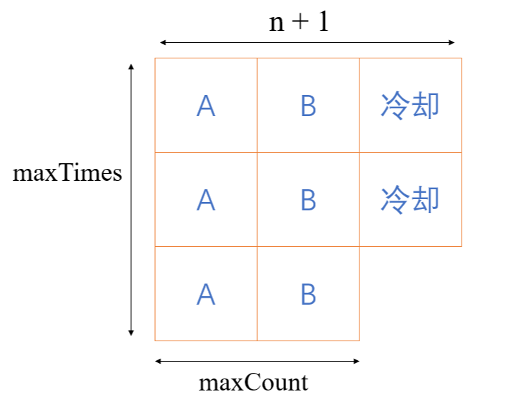

# 621. 任务调度器

## 题目
给你一个用字符数组 tasks 表示的 CPU 需要执行的任务列表。其中每个字母表示一种不同种类的任务。任务可以以任意顺序执行，并且每个任务都可以在 1 个单位时间内执行完。在任何一个单位时间，CPU 可以完成一个任务，或者处于待命状态。

然而，两个 相同种类 的任务之间必须有长度为整数 n 的冷却时间，因此至少有连续 n 个单位时间内 CPU 在执行不同的任务，或者在待命状态。

你需要计算完成所有任务所需要的 最短时间 。
 

    示例 1：
    输入：tasks = ["A","A","A","B","B","B"], n = 2
    输出：8
    解释：A -> B -> (待命) -> A -> B -> (待命) -> A -> B
        在本示例中，两个相同类型任务之间必须间隔长度为 n = 2 的冷却时间，而执行一个任务只需要一个单位时间，所以中间出现了（待命）状态。 

    示例 2：
    输入：tasks = ["A","A","A","B","B","B"], n = 0
    输出：6
    解释：在这种情况下，任何大小为 6 的排列都可以满足要求，因为 n = 0
    ["A","A","A","B","B","B"]
    ["A","B","A","B","A","B"]
    ["B","B","B","A","A","A"]
    ...
    诸如此类

    示例 3：
    输入：tasks = ["A","A","A","A","A","A","B","C","D","E","F","G"], n = 2
    输出：16
    解释：一种可能的解决方案是：
        A -> B -> C -> A -> D -> E -> A -> F -> G -> A -> (待命) -> (待命) -> A -> (待命) -> (待命) -> A

## 方法
容易想到的一种贪心策略为：先安排出现次数最多的任务，让这个任务两次执行的时间间隔正好为n。再在这个时间间隔内安排其他的任务。

例如：tasks = ["A","A","A","B","B","B"], n = 2

我们先安排出现次数最多的任务"A",并且让执行两个"A"的时间间隔2。在这个时间间隔内，我们用其他任务类型去填充，又因为其他任务类型只有"B"一个，不够填充2的时间间隔，因此额外需要一个冷却时间间隔。具体安排如下图所示：



其中，maxTimes为出现次数最多的那个任务出现的次数。maxCount为一共有多少个任务和出现最多的那个任务出现次数一样。

图中一共占用的方格即为完成所有任务需要的时间，即：  
$$(maxTimes - 1)*(n + 1) + maxCount$$

此外，如果任务种类很多，在安排时无需冷却时间，只需要在一个任务的两次出现间填充其他任务，然后从左到右从上到下依次执行即可，由于每一个任务占用一个时间单位，我们又正正好好地使用了tasks中的所有任务，而且我们只使用tasks中的任务来占用方格（没用冷却时间）。因此这种情况下，所需要的时间即为tasks的长度。

由于这种情况时再用上述公式计算会得到一个不正确且偏小的结果，因此，我们只需把公式计算的结果和tasks的长度取最大即为最终结果。
## 代码
```java
public int leastInterval(char[] tasks, int n) {
    int[] buckets = new int[26];
    for(int i = 0; i < tasks.length; i++){
        buckets[tasks[i] - 'A']++;
    }
    Arrays.sort(buckets);
    int maxTimes = buckets[25];
    int maxCount = 1;
    for(int i = 25; i >= 1; i--){
        if(buckets[i] == buckets[i - 1])
            maxCount++;
        else
            break;
    }
    int res = (maxTimes - 1) * (n + 1) + maxCount;
    return Math.max(res, tasks.length);
}
```